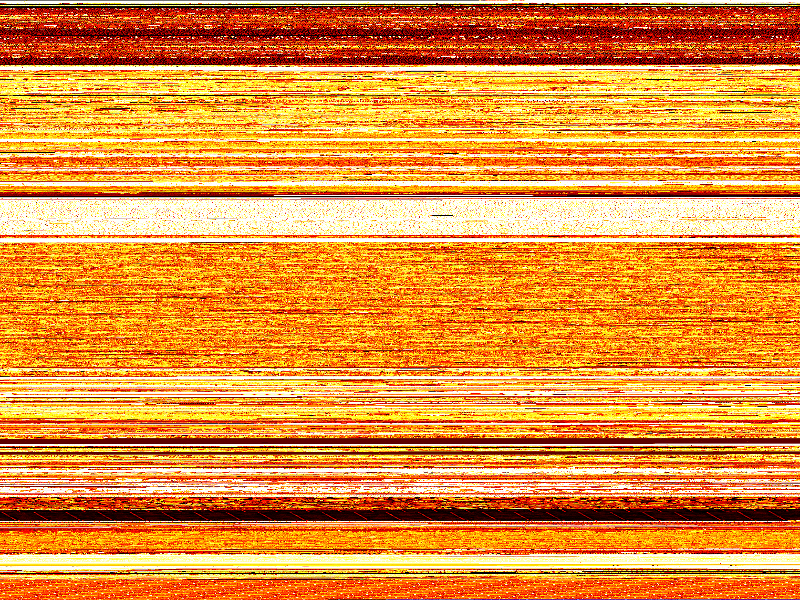

# stickpic; generate block device and file compressibility maps

This is a simple tool to generate a map of file or block device content compressibility in the form of a png image.
It uses the minilzo library to work out the compressibility of a block and translates this into one of three optional colormaps.
It also depends on the GD graphics library, which is part of many Linux distributions and can also be found here:
https://github.com/libgd/libgd/releases

This is useful to get a visual impression about where the data is on a disk drive, what type of data it is, how filesystems are
behaving and how or if TRIM is working (on SSDs). It is also useful to see thin provisioning in effect on SD cards.

Here is an example of a 500GB SSD before and after fstrim operation. It can be seen how some areas become more compressible (black) as they are returned as zeros after the trim operation. (Easiest to see with the cross-eye 3D method decribed for example here: https://www.kula3d.com/how-to-use-the-cross-eyed-method

While TRIM usage in SSDs is generally working and people have a general idea about this, SD cards can also benefit from occasional
trims. The wear levelling will have less pressure put on it and the cards will in general be a little bit faster.
It is important to understand that the trimming (I usually use Linux blkdiscard on the SD device) will not work when the cards is
accessed through typical card readers, which basically simulate a USB stick (thumb drive).
I have been successful using blkdiscard and fstrim when such cards are
used within a direct SD card slot in a notebook computer, or in a raspberry pi SD slot.
Also note that some cameras and video cameras can 'format' the card. This usually is a fast process and it leaves no trace of data
accessible on the cards and is probably using the same thin provisioning trim-type operation as blkdiscard and fstrim. The data is then
still somehow inside the flash (and could be recovered by the secret service) but not accessible by mere mortals anymore,
since the memory controller will mark the flash as 'free/dont care' and returns zeros or some other more or less random data (!) very
quickly when such blocks are read. It is important to understand that not all cards will return zeros when trimmed areas are accessed.
Apparently sometimes such areas will be pointed to internal flash parts containing some data (see 'thin provisioning', the devive will
always be bigger and contain internally more memory capacity than what it advertises to be able to function efficiently). While some
SSDs promise to return zeros when trimmed areas are accessed (deterministically return zero on trim), SD cards apparently 
don't do this. Some SSDs return determistic zeros (Linux then can rely on the promise), some promise to return deterministic data 
(i.e. always the same at the same address), and some don't even promise to always return the same data from such areas!
Check hdparm -I /dev/SSDdeviceName.

All SD cards in my possession can do the blkdiscard. It seems like they all implement this function. The Windows SD formatter tool by
the SD consortium tries to do a blkdiscard on the devices, but from my observations it also cannot do it through standard card readers.

All of these things on SD cards and SSDs can be visualized using the stickpic tool. Just take a 'snapshot' before and after a trim or
blkdiscard.

The tool will only read over your data and compress every block for compressibility assessment.

Here are some examples. First, an 8GB SD card used in a raspberry pi for quite a while. It contains a btrfs filesystem.
The lighter the color, the less compressible the data is. Black would be areas with zeros or highly compressible data,
then through red, yellow and white, data is less compressible (i.e. already compressed).

Now I issued a 'blkdiscard -v /dev/mmcblk0' on the device (note that this is a scary dangerous command, which, used on an SSD,
would nuke all your data into nirvana within milliseconds, so be very careful to get the device name right). The result is this:

So what happened here? The first roughly half of the SD card now looks highly compressible (black). I checked, seems to be all zeros.
The last two quarters of the drive is a repetitive pattern of random data that was not in these places before.
So apparently, the internal SD card memory controller destroyed the reference tables and it looks like it randomly
pointed accesses to some memory block, which in the
case of the second half still contains some data. Inspection shows that it is a repetitive block of some old filesystem content.
I did not check how large the block is or whether it was recent or old data from within the free wear levelling store.
Interesting nevertheless.

For good measure I overwrote the whole SD with some data and did another blkdiscard, this time resulting in a homogeneous picture,
which is not interesting to show here.

You can find some more patchy information on SD card 'erase' command CMD32, CMD33, CMD38 on the internet, but as always, many
vocal people are highly confused and it is hard to come by reliable info. Thus this tool, play with it and you will understand
this much better. At least it gives you a small window into the internal workings of these amazing little gadgets.

Some links below.
https://www.eevblog.com/forum/beginners/windows-app-to-erase-sd-cards/10/?wap2
